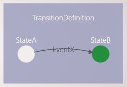

#XComponent User Guide

## Contents

* [1 - Overview](#1-overview)
* [2 - XComponent philosophy](#2-xcomponent-philosophy)
 * [Microservice definition](#microservice-definition)
 * [Component definition](#component-definition)
 * [State machine definition](#state-machine-definition)
 * [State definition](#state-definition)
 * [Transition definition](#transition-definition)
 * [Event definition](#event-definition)
 * [Triggered method](#triggered-method)
 * [Triggering rules](#triggering-rules)
 * [API](#api)
 * [Composition](#composition)
* [3 - XCStudion](#3-xcstudio)

## 1 - Overview

XComponent is an open platform to easily create, control and share microservices.
In XComponent, a microservice is a set of components. Each component is based on state machines.
This approach is powerful and flexible because it enables you to size or resize your microservices as you want.

XComponent provides the following tools:
* XCStudio: an application to design / compose components and microservices
* XCRuntime: an execution environment for xc microservices
* XCSpy: a test tool
* XComponent AC2: an application to deploy and control microservices
* XComponent Gallery: it enables you to share easily your projects

The following figure is a good summary of the XComponent architecture.

> Note: "Microservice architectural style is an approach to develop a single application as a suite of small services, each running in its own process and communicating with lightweight mechanisms. These services are built around business capabilities and independently deployable by fully automated deployment machinery.” *James Lewis & Martin Fowler*

# 2 - XComponent philosophy

XComponent is based on state machine diagrams. To design, implement and build your projects you’re going to use XCStudio and Visual Studio. 
XCStudio is an IDE to create microservices. 

The aim of this chapter is to provide you few definitions of the concepts related to XComponent including:
* a microservice
* a component
* a state machine
* a state
* a transition
* an event
* a triggered method
* a triggering rule
* an api
* a composition

### Microservice definition

> "Microservice architectural style is an approach to developing a single application as a suite of small units, each running in its own process and communicating with lightweight mechanisms" *Martin Fowler*

XComponent defines a microservice as a set of components. It leads to much more flexibility:
Indeed, you can begin with a monolith, and then split your architecture into microservices.

XComponent proposes to embrace the microservice style:
* Split each feature in a separate service
* Easy evolution, refactoring and scaling / accelerate innovation
* Single responsibility pattern (business oriented service) 
* Decoupled your microservices (Tolerant Reader Pattern for example)

This approach promotes the idea of "design for failure".
It means that your application has to tolerate service failures. For example, you can use circuit breakers and timeout patterns.

### Component definition

In XComponent, a component is a logical brick answering a functional need. It’s an aggregation of several state machines, each state machine made of several states linked to each other by transitions.

### State machine definition

The definition of a state machine is similar to a class in Object-Oriented Programming. It can be instantiated several times exactly as a class can be. A class instance is an object and in XComponent we call it a state machine instance. 
In XCStudio a state machine is a set of states, a state machine is delimited by a blue edge.

### State definition

A state is the current status of a state machine instance.
A state is represented by a colored circle in XCStudio.

### Transition definition

A transition is the only way to go from a state to another. A transition can be triggered by an event called a triggering event which is represented by a C# class. 
For instance let’s consider two states: StateA and StateB are linked by a transition: Trans1, triggered by event: EventX.
If we’re in StateA and EventX is received, the status changes from StateA to StateB.
Transitions are represented in XCStudio by arrows.
Below the scheme of previous example:

### Event definition

An event is an object that triggers a transition. When an event is received by a machine instance, it triggers a transition.

### Triggered method

This is the method called once the transition is activated in which you can do whatever you want. The developer codes the triggered method in C#.

### Triggering rules

Triggering rules have been set up to implement, if needed, tests before launching transition to make sure that when an event is received, we can change the state of the state machine instance.
You can check if data matches other, contains elements or implement specific rules using Visual studio.
If one test is not ok the transition is not launched and the current state doesn’t change.

### API

A client API defines the contract between external applications and components, in other words what you’re going to be able to do with the user applications. 
Example of user application can be generated using XC Studio (WPF or Console applications).

### Composition

The default composition view enables you to manage the dependencies (or links) between components and APIs.
It means that this view contains the definition of all the communication links between components and APIs.
* The link source is the component or API output.
* The link target is the component or API input.

The following figure shows a composition example:

The microservices composition view contains the definition of each microservice. Microservices composition example:

## 3 - XCStudio

XCStudio lets you:
- Design components
- Create API and microservices
- Configure environments
- Use Visual Studio to edit specific rules for your components.

The following part briefly describes XCStudio menus to give you an overview of how to use this application.

