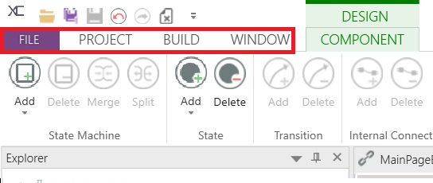
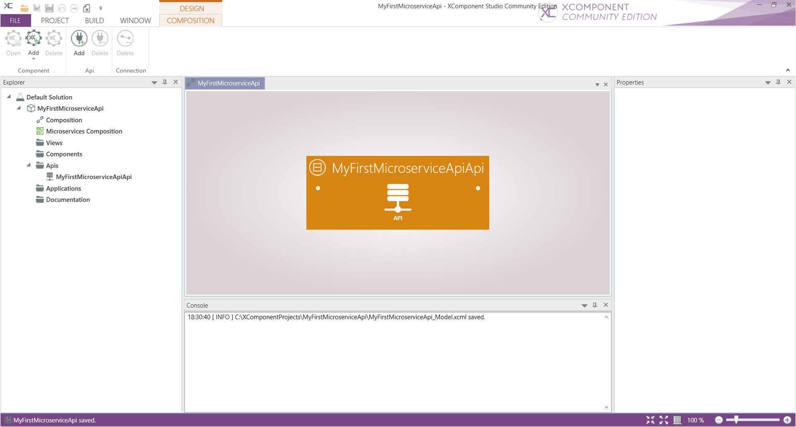
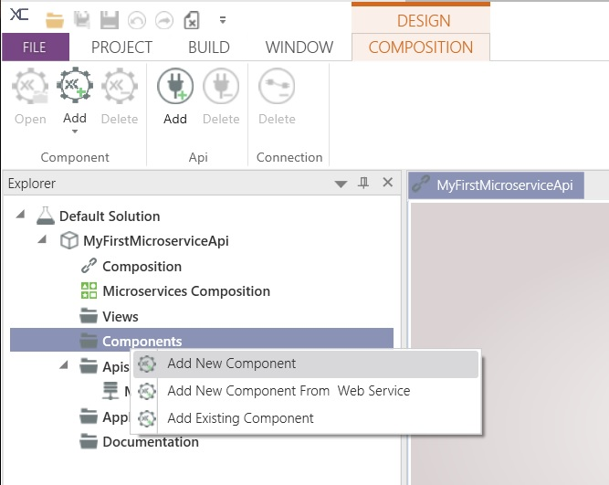
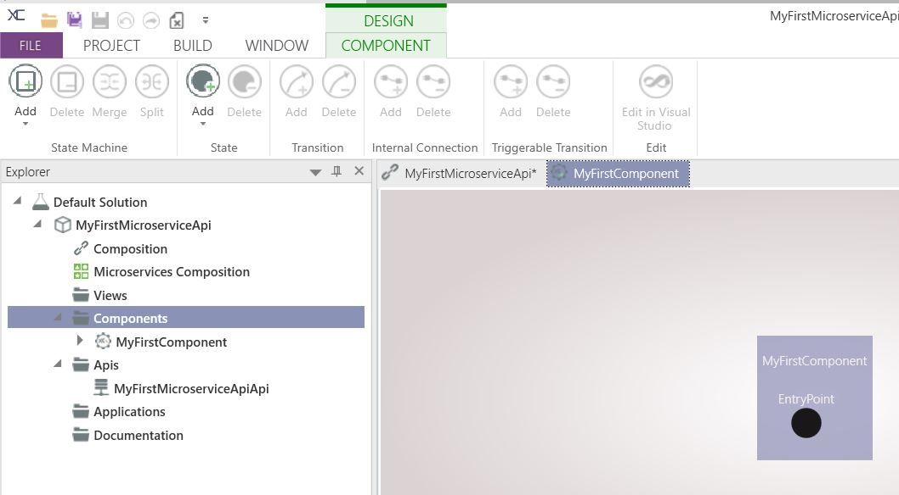
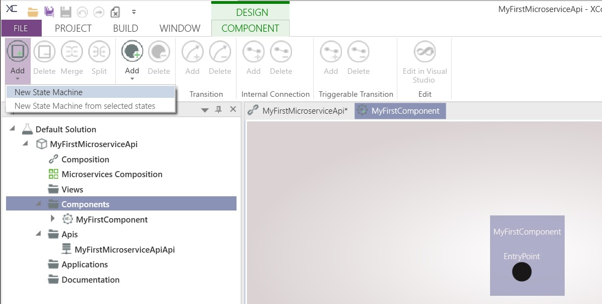

#XComponent User Guide

## Contents

* [1 - Overview](#1---overview)
* [2 - XComponent philosophy](#2---xcomponent-philosophy)
 * [Microservice definition](#microservice-definition)
 * [Component definition](#component-definition)
 * [State machine definition](#state-machine-definition)
 * [State definition](#state-definition)
 * [Transition definition](#transition-definition)
 * [Event definition](#event-definition)
 * [Triggered method](#triggered-method)
 * [Triggering rules](#triggering-rules)
 * [API](#api)
 * [Composition](#composition)
* [3 - XCStudio](#3---xcstudio)
 * [XCStudio menus](#xcstudio-menus)
 * [Top menu icon bar](#top-menu-icon-bar)
 * [XCStudio project hierarchy](#xcstudio-project-hierarchy)
 * [Creating a new project](#Creating-a-new-project)
 * [Navigate within your project](#navigate-within-your-project)
 * [Creating a new component](#creating-a-new-component)

## 1 - Overview

XComponent is an open platform to easily create, control and share microservices.
In XComponent, a microservice is a set of components. Each component is based on state machines.
This approach is powerful and flexible because it enables you to size or resize your microservices as you want.

XComponent provides the following tools:
* XCStudio: an application to design / compose components and microservices
* XCRuntime: an execution environment for xc microservices
* XCSpy: a test tool
* XComponent AC2: an application to deploy and control microservices
* XComponent Gallery: it enables you to share easily your projects

The following figure is a good summary of the XComponent architecture.

> Note: "Microservice architectural style is an approach to develop a single application as a suite of small services, each running in its own process and communicating with lightweight mechanisms. These services are built around business capabilities and independently deployable by fully automated deployment machinery.” *James Lewis & Martin Fowler*

# 2 - XComponent philosophy

XComponent is based on state machine diagrams. To design, implement and build your projects you’re going to use XCStudio and Visual Studio. 
XCStudio is an IDE to create microservices. 

The aim of this chapter is to provide you few definitions of the concepts related to XComponent including:
* a microservice
* a component
* a state machine
* a state
* a transition
* an event
* a triggered method
* a triggering rule
* an api
* a composition

### Microservice definition

> "Microservice architectural style is an approach to developing a single application as a suite of small units, each running in its own process and communicating with lightweight mechanisms" *Martin Fowler*

XComponent defines a microservice as a set of components. It leads to much more flexibility:
Indeed, you can begin with a monolith, and then split your architecture into microservices.

XComponent proposes to embrace the microservice style:
* Split each feature in a separate service
* Easy evolution, refactoring and scaling / accelerate innovation
* Single responsibility pattern (business oriented service) 
* Decoupled your microservices (Tolerant Reader Pattern for example)

This approach promotes the idea of "design for failure".
It means that your application has to tolerate service failures. For example, you can use circuit breakers and timeout patterns.

### Component definition

In XComponent, a component is a logical brick answering a functional need. It’s an aggregation of several state machines, each state machine made of several states linked to each other by transitions.

### State machine definition

The definition of a state machine is similar to a class in Object-Oriented Programming. It can be instantiated several times exactly as a class can be. A class instance is an object and in XComponent we call it a state machine instance. 
In XCStudio a state machine is a set of states, a state machine is delimited by a blue edge.

### State definition

A state is the current status of a state machine instance.
A state is represented by a colored circle in XCStudio.

### Transition definition

A transition is the only way to go from a state to another. A transition can be triggered by an event called a triggering event which is represented by a C# class. 
For instance let’s consider two states: StateA and StateB are linked by a transition: Trans1, triggered by event: EventX.
If we’re in StateA and EventX is received, the status changes from StateA to StateB.
Transitions are represented in XCStudio by arrows.
Below the scheme of previous example:

### Event definition

An event is an object that triggers a transition. When an event is received by a machine instance, it triggers a transition.

### Triggered method

This is the method called once the transition is activated in which you can do whatever you want. The developer codes the triggered method in C#.

### Triggering rules

Triggering rules have been set up to implement, if needed, tests before launching transition to make sure that when an event is received, we can change the state of the state machine instance.
You can check if data matches other, contains elements or implement specific rules using Visual studio.
If one test is not ok the transition is not launched and the current state doesn’t change.

### API

A client API defines the contract between external applications and components, in other words what you’re going to be able to do with the user applications. 
Example of user application can be generated using XC Studio (WPF or Console applications).

### Composition

The default composition view enables you to manage the dependencies (or links) between components and APIs.
It means that this view contains the definition of all the communication links between components and APIs.
* The link source is the component or API output.
* The link target is the component or API input.

The following figure shows a composition example:

The microservices composition view contains the definition of each microservice. Microservices composition example:

## 3 - XCStudio

XCStudio lets you:
- Design components
- Create API and microservices
- Configure environments
- Use Visual Studio to edit specific rules for your components.

The following part briefly describes XCStudio menus to give you an overview of how to use this application.

### XCStudio menus

You navigate through 4 menus and a context menu:

The five top menus lets you control views and preferences of the project:
- File menu: to create, open, save XComponent project, configure XCStudio and set user settings
- Project: a global view of your XComponent project where you can edit your project settings, export and run your application.
- Build menu: to build a component or the entire project
- Window menu: to edit display preferences.

The context menu depends on the selected window. In the previous screenshot, It provides tools to design your components and to customize your composition.

### Top menu icon bar

Around XComponent logo (in the top left hand corner) there’s a quick launch icon bar gathering the most used actions:

From left to right these shortcuts are:
- Open project (Ctrl + O)
- Save current project (Ctrl + Maj + S)
- Save current document (Ctrl + S)
- Close current project (Ctrl + W)

### XCStudio project hierarchy

XCStudio projects are stored in *.xcml files.

Default XCStudio projects directory is “C:\XComponentProjects\{projectNameYouHaveChosen}\”
Here below is the generated project hierarchy:

When creating a new project you can change the default location.

Other files can be stored in project directory, for instance if you generate GUI applications, by default location proposed by XCStudio is the same directory.

### Creating a new project

Start XCStudio and click on the *File* menu and select the new item. The following window is displayed:

Enter project name: for instance MyFirstMicroservice.

The project window appears, you will be able to add components and api. You can see that an API called MyFirstMicroserviceApi has already been created by default.

### Navigate within your project

The explorer panel gives you an entire view of your project. 

It contains:
- A shortcut to your linking
- The composition
- The components
- The APIs
- The GUI applications
- Your project documentation

### Creating a new component

To add a new component, just use the context menu in the explorer panel:

The application switches automatically to the component menu and leaves you to a space where you can edit component.

> Note that there is already a state machine on this window. It’s the entry point and cannot be removed. The entry point is the first state created by the XComponent Runtime.

This is what you have on the screen in standard profile hiding properties error and console.

To add a new state machine in your component, just click on the add button as shown in the next figure.
 

There is a second way to do this: let CTRL pressed while double clicking on the white wide empty zone. This action creates a state. If you’re not double clicking inside a state machine, creating this state also creates a state machine.

> Note: you can add a transition different ways:
> * select two states and use the add button (ribbon)
> * select a state and drag the blue circle to another state…

Follow these instructions to create a simple state machine with 2 states and 1 transition:
- Add a new state machine
- *StateMachine2* appears. Double click on *StateMachine2* text to rename it to “FrontOffice”.
- Click on *State2* a blue circle appears to show you that the selection is on the *State2* state and click on  and *new State form the selected states*
- Drag *State3* to somewhere else in order to be able to read *Transaction1* on the arrow
- Double click on *State2* text to rename it to *Pending*
- Double click on *State3* text to rename it to *Validated*
- Double click on *Transition1* text to rename it to “ValidateFrontOffice”
- Add a transition between EntryPoint and Pending
- Rename the transition to *SendToFrontOffice*
- Rename *StateMachine1* to *Entry*

The component looks like this:

> It is important to notice that each time you arrive on a state machine from another, a new instance of state machine is created.

Save your component: File + Save or Crtl+S.
Notice that you can save the project by using the Maj+Ctrl+S shortcut

