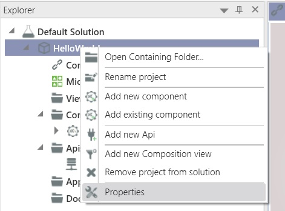
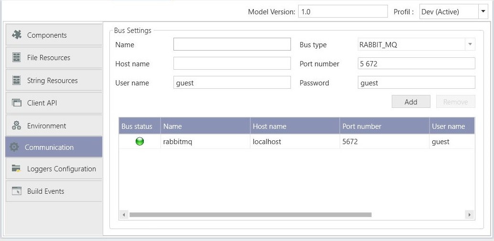

# Calculator: step by step tutorial

This document describes how to create a simple `Calculator` microservice with XComponent whose triggered methods are implemented in JavaScript instead of C#.

## Overview

XComponent is a platform to create, monitor and share microservices.

In the `Calculator` sample we are going to create two different pieces of software:
* **`[Calculator microservice]`** - A XComponent microservice that receives requests to calculate additions;
* **`[Calculator.js worker]`** - A simple NodeJS application to run triggered methods coded in JavaScript.

## Install XComponent Community

The easiest way to install the XComponent Community Edition is to download the latest version from [Nuget](https://www.nuget.org/packages/xcomponent.community/)

## Create your first microservice

### Create a new XComponent project

* Start XCStudio **`[packages\XComponent.Community\tools\XCStudio\XCStudio.exe]`**

* Create a new project named **`Calculator`**:

### Create your first component

* Create a new *component* named **`Calculator`**:


 * Create a *CalculatorManager* and a *Calculator* state machines  
 > Note : the *CalculatorManager* create instances of *Calculator* with two numbers as input, through *Calculate* transition. The *Calculator* state machine do operation(s) with the inputs.   

 You should end up with the following component:

 
  
  * On *Entry_Point*, *Ready*, *Calculating* and *Done* states triggered methods select *Rest Worker* so as they wont be generated in C# but will be implemented in any other language able to consume REST services. In the present example we will use JavaScript.

### Complete your composition view
 
* Go back to the composition view
* Add links between your component and the default api.
   
You should end up with the following figure:
   

  
> Note: In the composition view, on each component, inputs are the left side bullet points and component outputs are the right side bullet points.

### Configuration

* Open the properties window of your project (see following figure)



* Fill the RabbitMQ settings:

In the *Communication* section choose a name for the RabbitMQ bus and click on the *Add* button.
You should see your bus with a green indicator as in the following figure:



In the *Components* section change the deployment target from *Stand Alone* to *Server*.
In the drop down you should see the previously configured RabbitMQ bus.


## Test your microservice

* Build your solution (see following figure)


* Start your microservice (*Project* menu + *Run* sub menu + *Microservices* button and then the *Start* button)
* Create a NodeJS application to implement your triggered methods
* Copy/Paste the following code in *calculator.js*

```js
var http = require('http');

function getOptions(stmPath) {
    return {
        host:"127.0.0.1",
        port: 9676,
        path: stmPath,
        method: 'GET'
    }
}
var postheaders = {
    'Content-Type' : 'application/json',
};
var postOptions = {
    host:"127.0.0.1",
    port: 9676,
    path:'/api/Functions',
    method: 'POST',
    headers : postheaders
};

function getTask(options, cb)
{
    http.request(options, function(res)
    {
        var body = '';
        res.on('data', function(chunk){
                body += chunk;
        });
        res.on("end", function()
        {
            if( body == "null")
            {
                cb("Body is null", null);
                return;
            }
            var taskObj = JSON.parse(body);
           
            cb(null, taskObj);
        });
        res.on('error', cb);
    }
    )
    .on('error', cb)
    .end();
}

function postResult(options, jsonResponse)
{
   
    var post_req = http.request(options, function(res) {
        res.on('data', function (chunk) {
            console.info('POST result:\n');
            process.stdout.write(chunk);
            console.info('\n\nPOST completed');
        });
    });
  
    // post the data
    post_req.write(jsonResponse);
    post_req.end();
    post_req.on('error', function(e) {
        console.error(e);
    });
    
  
}

//Trigger methods to excute on CalculatorManager state machine
var CalculatorManagerExecuter = setInterval(function()
{
   getTask(getOptions('/api/Functions?componentName=Calculator&stateMachineName=CalculatorManager'), function(err, taskObj)
    {
        if( taskObj != null)
        {
            console.log("Getting Task: ", taskObj);
            var jsonResponse;
            //Trigger method to excute on Entry_Point state 
            if( taskObj.FunctionName === "ExecuteOn_EntryPoint")
            {
               jsonResponse = {
                   "ComponentName":taskObj.ComponentName,
                   "StateMachineName":taskObj.StateMachineName,
                   "Senders" :  
                    [
                        {
                            "SenderName" : "Init",
                        }
                    ],
                   "RequestId":taskObj.RequestId
               };

               console.log("Response : ", jsonResponse);
               postResult(postOptions, JSON.stringify(jsonResponse));
            }
            //Trigger method to excute on Ready state 
            else if( taskObj.FunctionName === "ExecuteOn_Ready_From_Up_Through_Prepare")
            {
                jsonResponse = {
                    "ComponentName":taskObj.ComponentName,
                    "StateMachineName":taskObj.StateMachineName,
                    "Senders" :  
                    [
                         {
                             "SenderName" : "Calculate",
                             "SenderParameter" : { "Number1" : 5, "Number2" : 3},
                             "UseContext" : true
                         }, 
                         {
                             "SenderName" : "Relaunch"
                         }
                     ] ,
                    "RequestId":taskObj.RequestId
                };
 
                console.log("Response : ", jsonResponse);
                postResult(postOptions, JSON.stringify(jsonResponse));
            }
            else
            {
                console.error("Unknown task : ", taskObj);
            }
       }
   });
}, 1000);

//Triggered methods to execute on Calculor state machine 
 setInterval(function()
 {
    getTask(getOptions('/api/Functions?componentName=Calculator&stateMachineName=Calculator'), function(err, taskObj)
    {
        if (err) {
            console.error(err);
        } 
        else 
        {
            clearTimeout(CalculatorManagerExecuter);
            if( taskObj != null)
            {
                console.log("Getting Task: ", taskObj);
                var result = 0;
                var jsonResponse;
                //Trigger method to excute on InitializePublicMember
                if( taskObj.FunctionName === "InitializePublicMember")
                {
                    var result = taskObj.Event.Result;
                    jsonResponse = JSON.stringify({
                        "ComponentName":taskObj.ComponentName,
                        "StateMachineName":taskObj.StateMachineName,
                        "PublicMember": {"Result" : 10},
                        "Senders" : [],
                        "RequestId":taskObj.RequestId
                    });
    
                    console.log("Response : ", jsonResponse);
                    postResult(postOptions, jsonResponse);
                }
                //Trigger methods to excute on Calculating state
                else if( taskObj.FunctionName === "ExecuteOn_Calculating_From_Ready_Through_Calculate")
                {
                    var number1 = taskObj.Event.Number1;
                    var number2 = taskObj.Event.Number2;
                    var result = number1 * number2;
                    if(result >= 0)
                    {
                        jsonResponse = JSON.stringify({
                            "ComponentName":taskObj.ComponentName,
                            "StateMachineName":taskObj.StateMachineName,
                            "PublicMember": {"Result" : result},
                            "Senders" : 
                            [
                                {
                                    "SenderName" : "Finished",
                                    "UseContext" : true,
                                    "SenderParameter": {
                                        "Result" : result,
                                    }
                                }
                            ] ,
                            "RequestId":taskObj.RequestId
                        });
                    }
                    else
                    {
                        jsonResponse = JSON.stringify({
                            "ComponentName":taskObj.ComponentName,
                            "StateMachineName":taskObj.StateMachineName,
                            "PublicMember": { "ErrorMessage" : "Bad value" },
                            "Senders" : 
                            [
                                {
                                    "SenderName" : "Error",
                                    "UseContext" : true,
                                    "SenderParameter": {
                                        "Result" : taskObj.Value,
                                    }
                                }
                            ] ,
                            "RequestId":taskObj.RequestId
                        });
                    }
    
                    console.log("Response : ", jsonResponse);
                    postResult(postOptions, jsonResponse);
                }
                //Trigger method to excute on Done state
                else if( taskObj.FunctionName === "ExecuteOn_Done_From_Calculating_Through_Finished")
                {
                    var result = taskObj.Event.Result;
                    jsonResponse = JSON.stringify({
                        "ComponentName":taskObj.ComponentName,
                        "StateMachineName":taskObj.StateMachineName,
                        "PublicMember": {"Result" : result},
                        "Senders" : [],
                        "RequestId":taskObj.RequestId
                    });
    
                    console.log("Response : ", jsonResponse);
                    postResult(postOptions, jsonResponse);
                }
                else
                {
                    console.error("Unknown task : ", taskObj);
                }
            }        
        }
    });
 }, 1000);
```

* Run your NodeJS application. You should end up with an output similar to that:

```txt 
Body is null
Getting Task:  
{ 
    Event: {},
    PublicMember: {},
    InternalMember: {},
    Context:
    { PublishNotification: true,
        StateMachineId: 1,
        WorkerId: 1,
        StateCode: 0,
        StateMachineCode: 2032672968,
        ComponentCode: 93084851,
        PrivateTopic: null,
        MessageType: null,
        ErrorMessage: null,
        SessionData: null },
    ComponentName: 'Calculator',
    StateMachineName: 'CalculatorManager',
    FunctionName: 'ExecuteOn_EntryPoint',
    RequestId: 'a334d5d0-8e91-4daf-a810-f2ada85dad96' 
}
Response :  
{ 
    ComponentName: 'Calculator',
    StateMachineName: 'CalculatorManager',
    Senders: [ { SenderName: 'Init' } ],
    RequestId: 'a334d5d0-8e91-4daf-a810-f2ada85dad96' 
}
Body is null
Getting Task:  
{ 
    Event: {},
    PublicMember: {},
    InternalMember: {},
    Context:
    { PublishNotification: true,
        StateMachineId: 1,
        WorkerId: 1,
        StateCode: 1,
        StateMachineCode: 2032672968,
        ComponentCode: 93084851,
        PrivateTopic: null,
        MessageType: null,
        ErrorMessage: null,
        SessionData: null },
    ComponentName: 'Calculator',
    StateMachineName: 'CalculatorManager',
    FunctionName: 'ExecuteOn_Ready_From_Up_Through_Prepare',
    RequestId: '8531d4ad-4b11-4de3-a231-6a07759dd000' 
}
Response :  
{ 
    ComponentName: 'Calculator',
    StateMachineName: 'CalculatorManager',
    Senders:
    [ 
        { 
            SenderName: 'Calculate',
            SenderParameter: [Object],
            UseContext: true 
        },
        { SenderName: 'Relaunch' } 
    ],
    RequestId: '8531d4ad-4b11-4de3-a231-6a07759dd000' 
}
Getting Task:  
{ 
    Event: { ParentPublicMember: {}, ParentInternalMember: {} },
    PublicMember: { Result: 0, ErrorMessage: null },
    InternalMember: {},
    Context: {},
    ComponentName: 'Calculator',
    StateMachineName: 'Calculator',
    FunctionName: 'InitializePublicMember',
    RequestId: '58b3a178-9025-4bdf-9081-0953cb7a567e' 
}
Response :  
{
    "ComponentName":"Calculator",
    "StateMachineName":"Calculator",
    "PublicMember":{"Result":10},
    "Senders":[],
    "RequestId":"58b3a178-9025-4bdf-9081-0953cb7a567e"
}
Getting Task:  
{ 
    Event: { Number1: 5, Number2: 3 },
    PublicMember: { Result: 0, ErrorMessage: null },
    InternalMember: {},
    Context:
    { PublishNotification: true,
        StateMachineId: 2,
        WorkerId: 2,
        StateCode: 0,
        StateMachineCode: 93084851,
        ComponentCode: 93084851,
        PrivateTopic: null,
        MessageType: null,
        ErrorMessage: null,
        SessionData: null },
    ComponentName: 'Calculator',
    StateMachineName: 'Calculator',
    FunctionName: 'ExecuteOn_Calculating_From_Ready_Through_Calculate',
    RequestId: '7f5c5b1e-c83a-41eb-88bb-06b15c6f1dc3' 
}
Response :  
{
    "ComponentName":"Calculator",
    "StateMachineName":"Calculator",
    "PublicMember":{"Result":15},
    "Senders":
    [
        {
            "SenderName":"Finished",
            "UseContext":true,
            "SenderParameter":{"Result":15}
        }
    ],
    "RequestId":"7f5c5b1e-c83a-41eb-88bb-06b15c6f1dc3"
}
Getting Task:  
{ 
    Event: { Result: 15 },
    PublicMember: { Result: 15, ErrorMessage: null },
    InternalMember: {},
    Context:
    { PublishNotification: true,
        StateMachineId: 2,
        WorkerId: 2,
        StateCode: 1,
        StateMachineCode: 93084851,
        ComponentCode: 93084851,
        PrivateTopic: null,
        MessageType: null,
        ErrorMessage: null,
        SessionData: null },
    ComponentName: 'Calculator',
    StateMachineName: 'Calculator',
    FunctionName: 'ExecuteOn_Done_From_Calculating_Through_Finished',
    RequestId: '0ee6cd18-6f0e-4766-b057-abc43994d43b' 
}
Response :  
{
    "ComponentName":"Calculator",
    "StateMachineName":"Calculator",
    "PublicMember":{"Result":15},
    "Senders":[],
    "RequestId":"0ee6cd18-6f0e-4766-b057-abc43994d43b"
}
Body is null
``` 

## Questions?

If you have any questions about this sample, please [create a Github issue for us](https://github.com/xcomponent/xcomponent/issues)!
