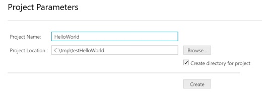
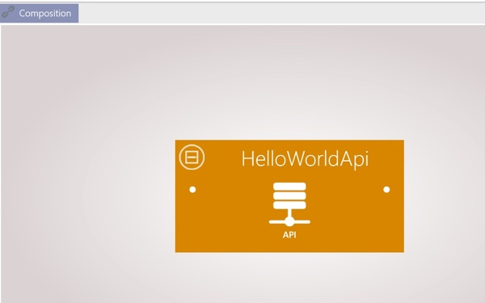
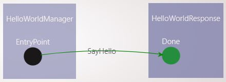
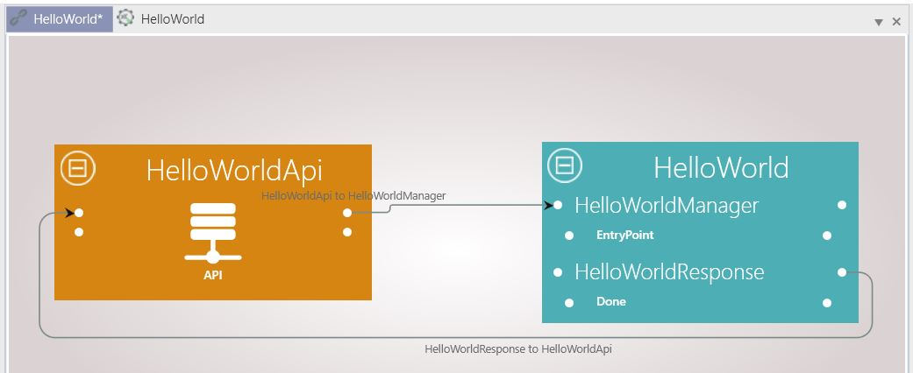
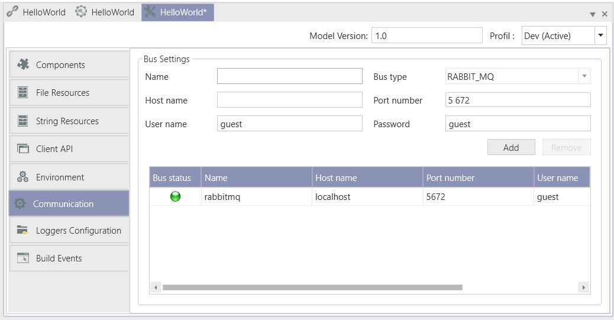
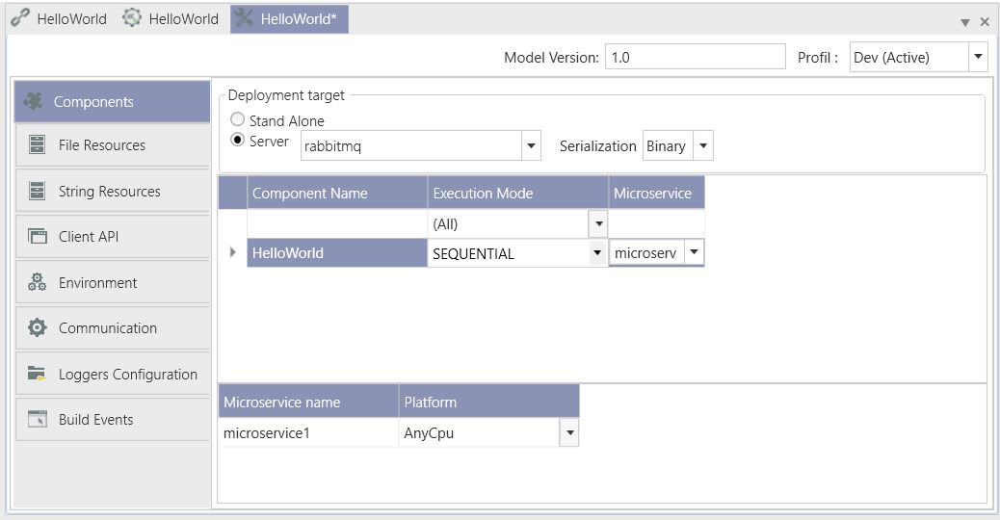
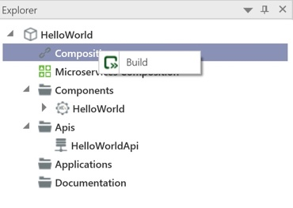
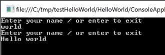

# Hello World: step by step tutorial

This document describes how to create a simple `Hello World` microservice with XComponent.
It gives new users a quick overview of XComponent tools.

## Overview

XComponent is a platform to create, monitor and share microservices.

In the `Hello World` sample we are going to create two different pieces of software:
* **`[Hello World microservice]`** - A microservice that receives *say hello* requests 
* **`[Console Application]`** - A simple application to test our microservice

## Install XComponent Community

 
The easiest way to install the XComponent Commmunity Edition is to download the latest version from [Nuget](https://www.nuget.org/packages/xcomponent.community/)

## Create your first microservice

### Create a new XComponent project

* Start XCStudio **`[packages\XComponent.Community\tools\XCStudio\XCStudio.exe]`**

* Create a new project named **`HelloWorld`**:



> Note: By default, a client API is already created (see following figure).



A client API enables you to define how client applications interact with your microservices.

> Note: In XComponent, a microservice is a set of components.

### Create your first component

* Create a new *component* named **`HelloWorld`**:


> Note: In XComponent, a component is a set of state machines.

* Implementation of this new component
 * Rename the automatically created *StateMachine1* to *HelloWorldManager*
 * Add a new state named *Done* by double clicking in the designer view (a state and its state machine are created)
 * Rename the automatically generated *StateMachine2* to *HelloWorldResponse*
 * Add a transition named *SayHello* from *EntryPoint* to *Done*

 You should end up with the following component:

 

 * Display the *Add new class* panel: *Window* menu + *Add new class* item
 * Select the *SayHello* transition and generate a class named *SayHello* containing a string property named *Name*
 (click on the *AddAndSet* button to generate the class and to associate it with our transition)
  
 > Note: We have to define events to trigger each transition (an event is represented by a C# class)
  
 * Select the *HelloWorldResponse* state machine and generate a class named *HelloWorldResponse* containing a string property named *Value*
 (click on the *AddAndSet* button to generate the class and to associate it with our state machine)
  
 > Note: Each state machine can be linked to an object called *Public Member*. 
 > It is important to point out that an event notification (based on the public member) is published when the state of the state machine is updated.
  
 * Now, we want to add a custom action (code) on the *Done* state when the *SayHello* transition is triggered.
 Just select the *Done* state and check the triggered method called *SayHello* (see the following figure)
  
 
  
 * Build your component (*Build* menu)
 * Edit triggered methods in Visual Studio (*Component* menu and *Edit in visual studio* sub item)
 * Open the following file: **`HelloWorldResponseTriggeredMethod`**
 * Add the following implementation to the *ExecuteOn_Done_Through_SayHello* method:
 ```cs
 helloWorldResponse.Value = "Hello " + sayHello.Name;
 ```
 > Note: As XComponent is a message driven platform, you have to create an answer wrapped in the public member of the state machine *response*.
  
### Create your composition
 
* Go back to the composition view
* Add links between your component and the default api.
 * A link to enable the api to send events to the entrypoint state
 * A link to receive response notifications
   
You should end up with the following figure:
   

  
> Note: In the composition view, component inputs are the left bullet points and component outputs are the right bullet points.

### Configuration

* Open the properties window of your project (see following figure)


* Add rabbitmq settings:

In the *Communication* section choose a name for the rabbitmq bus and click on the *Add* button.
You should see your bus with a green indicator as in the following figure:



* Set the deployment target to *server*

In the *Components* section change the Deployment Target from *Stand Alone* to *Server*.
In the drop down you should see the previously configured rabbitmq bus.



### Microservices composition

* In *Explorer* panel, double click on *microservices composition*
* Rename your microservice (containing your *HelloWorld* component) to *HelloWorldMicroservice*


> Note: To rename a microservice, just right click on its name and select *rename microservice*. 

## Test your microservice

* Build your project (see following figure)



* Start your microservice (*Project* menu + *Run microservices* sub menu + *Start* button)
* Create a simple console application to test your microservice (*Project* menu + *Generate console app* sub menu)
* Copy/Paste the following code in *Program.cs*

```cs
using System;
using XCClientAPICommon.ApiExtensions;
using XCClientAPICommon.Client;
using XComponent.HelloWorld.HelloWorldApi;
using XComponent.HelloWorld.UserObject;

namespace HelloWorldClientApplication
{
    class Program
    {
        static void AnalyseReport(InitReport report)
        {
            if (!string.IsNullOrEmpty(report.Message))
            {
                Console.WriteLine("Init failed : {0}", report.Message);
            }
            foreach (var componentName in report.ComponentsInitSucceeded)
            {
                Console.WriteLine("Init succeeded : {0}", componentName);
            }
            foreach (var componentName in report.ComponentsInitFailed)
            {
                Console.WriteLine("Init failed : {0}", componentName);
            }
        }

        private static string GetName()
        {
            Console.WriteLine("Enter your name / or enter to exit");
            return Console.ReadLine();
        }

        static void Main(string[] args)
        {
            // Initialize the interfaces
            using (var myhelloworldApi = new ApiWrapper<HelloWorldApi>())
            {
                ClientApiOptions clientApiOptions = new ClientApiOptions(); //fill this object to override default xcApi parameters

                myhelloworldApi.Api.HelloWorld_Component.HelloWorldResponse_StateMachine.InstanceUpdated += instance => Console.WriteLine(instance.PublicMember.Value);

                if (myhelloworldApi.Init(myhelloworldApi.Api.DefaultXcApiFileName, clientApiOptions))
                {
                    var context = myhelloworldApi.Api.HelloWorld_Component.GetEntryPoint().Context;

                    var name = GetName();
                    while (!string.IsNullOrWhiteSpace(name))
                    {
                        myhelloworldApi.Api.HelloWorld_Component.HelloWorldManager_StateMachine.EntryPoint_State.SayHello(context, new SayHello { Name = name });
                        name = GetName();
                    }
                }
                else
                {
                    AnalyseReport(myhelloworldApi.Report);
                }
            }
        }
    }
}
```

> Note: this simple code enables you to send *SayHello* requests and listen to answers.

* Run your console application. You should end up with the following output: 



## Questions?

If you have any questions about this sample, please [create a Github issue for us](https://github.com/xcomponent/xcomponent.helloworld/issues)!
